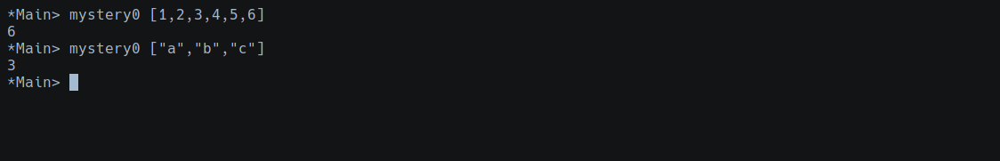
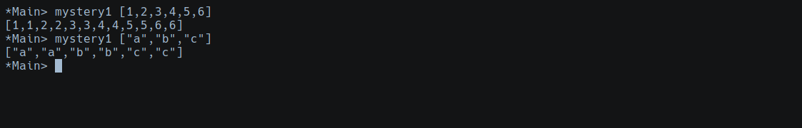
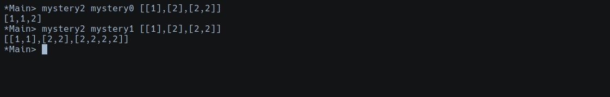
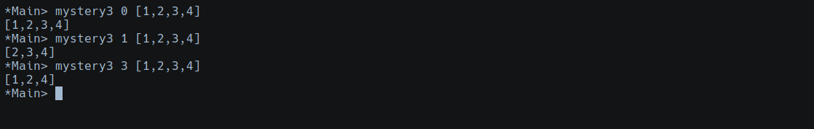
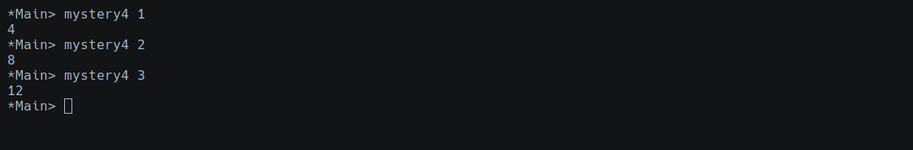
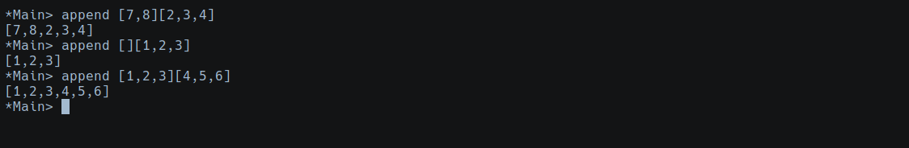

# Haskell Assignment 2

## Instructions
What do the following functions do?:

1. Counts the number of elements in a list.
```Haskell
mystery0 [] = 0
mystery0 (a:x) = 1 + mystery0 x
```


2. Duplicates each element in a list.
```Haskell
mystery1 xs = [y|x <- xs, y <- [x,x]]
```


3. Takes a function and applies it to a list.
```Haskell
mystery2 f [] = []
mystery2 f (a:x) = f a : mystery2 f x
```


4. Removes an item froma list if found.
```Haskell
mystery3 item [] = []
mystery3 item (x:y) | item==x = mystery3 item y
                    | otherwise = x : mystery3 item y
```


5. Multiplies x number by 2 two times.
```Haskell
mysteryd = (*) 2
mysteryr f x = f (f x)
mystery4 = mysteryr mysteryd
```


6. Appends two lists
```Haskell
append :: [a] -> [a] -> [a]
append [] ys = ys
append (x:xs) ys = x:append xs ys
```

