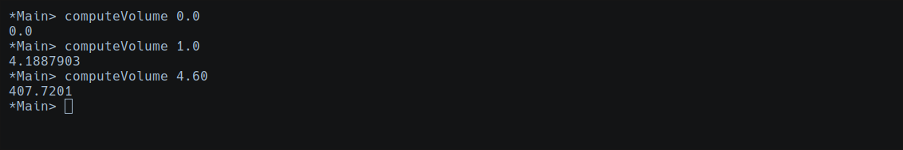
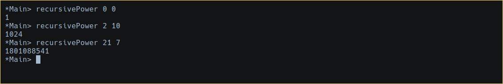
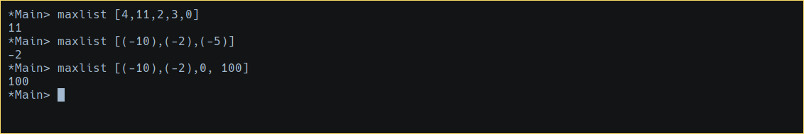
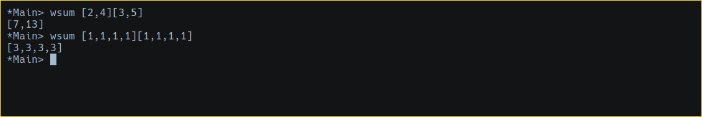
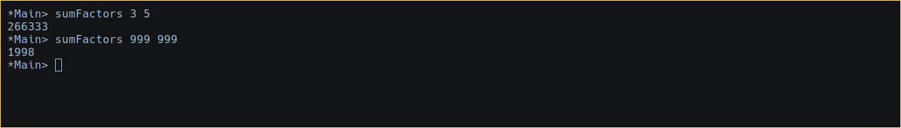

# Haskell Assignment 3

## Instructions
For full credit, do enough of the following to earn 10 points.

### 1. Volume of a Sphere
[2 points] Write a function to compute the volume of a sphere, given its radius.
__Note:__ The input is a Float.
```Haskell
computeVolume :: Float -> Float
computeVolume x = (4/3) * pi * (x)^3
```


### 2. Recursive Power
[2 points] Write a recursive function to raise a number to a power.
__Note:__ The input are two Integers.
```Haskell
recursivePower:: Int -> Int -> Int
recursivePower x 0 = 1
recursivePower x p = x * recursivePower x (p-1)
```


### 3. Max List
[2 points] The implementation of the function _maxlist_ below generally manages to find the largest element in a list of integers, but fails if all are negative. Fix it by adding one line.

```Haskell
mymax a b
  | a > b = a
  | b > a = b
  | otherwise = a
maxlist [] = 0
maxlist (head:tail) = mymax head(maxlist tail)
```
The line that is missing is:
```Haskell
maxlist [x] = x
```
Because we were defaulting empty list to 0 and zero is bigger than any negative number, thus it was failing to check the biggest number. The final function will look as follows:
``` Haskell
mymax a b
  | a > b = a
  | b > a = b
  | otherwise = a
maxlist [] = 0
maxlist [x] = x
maxlist (head:tail) = mymax head (maxlist tail)
```


### 4. wsum and zipWith
[2 points] Use the built-in function _zipWith_ to write a function _wsum_ that adds up two lists, while double-weighting the elements in the first list:
```Haskell
> wsum [2,4][3,5]
[7,13]
> wsum [1,1,1,1][1,1,1,1]
[3,3,3,3]
```
The resulting code is the following:
```Haskell
wsum :: Num a => [a] -> [a] -> [a]
wsum [][] = []
wsum xs xy = zipWith (+) (map (*2) xs) xy
```


### 5. Natural Number Sum
[2 points] Write an expression to compute the sum of all the natural numbers less than one thousand that are multiples of 3 or 5.

This solution uses two functions.
1. Returns a list of factors from 1 to 999 divisible by an Integer between the values of [1, 999] inclusive.
```Haskell
factors :: Int -> [Int]
factors m
  | m < 1 || m > 999 = error "Parameter should be 1000 > m > 0"
  | otherwise = [x | x <- [1..999], x `mod` m == 0]
```
2. Produce the sum of all the factors divisible by either x or y.
```Haskell
sumFactors:: Int -> Int -> Int
sumFactors x y = sum (factors x) + sum (factors y)
```


### 5. Interleaved String
[2 points] The `exitstsAtFirst` function can detect some cases where one string is a substring of another, for example "utep"
 in "luteplayer" and "nmsu" in "janmsutcliff"
This solution uses two functions.

```Haskell
prefix [] anything = True
prefix (x:xs) (y:ys) = x = y && prefix xs ys

exitstsAtFirst [] anything = True
exitstsAtFirst anything [] = False
exitstsAtFirst (x:xs) (y:ys)
  | x == y = prefix xs ys
  | otherwise = exitstsAtFirst (x:xs) ys
```

Now create a function `expandsTo` that can also detect cases with interleaved distractor letters, so that, for example, both the following return True.
```Haskell
expandsTo "utep" "united replicants"
expandsTo "nmsu" "normality assumption"
```


### 6. Iterative comparison
[2 points] For one of the above problems, list and describe the major differences between your Haskell solution and a typical iterative program for the same problem.

```Haskell
```

Now create a function `expandsTo` that can also detect cases with interleaved distractor letters, so that, for example, both the following return True.
```Python
```


