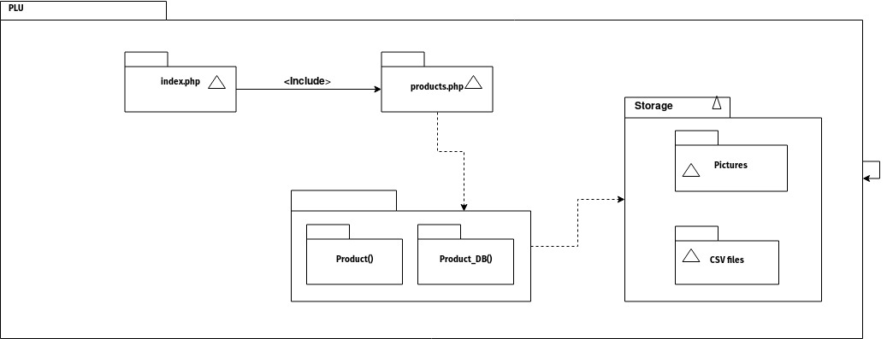

# Sergio David Munoz Sierra - 80500789
# PLU

Price look-up codes made easy developed in PHP.

## Class demo version of the report

### URL of the prototype
The prototype is running on localhost in my laptop. To run in your own machine please clone the following repo: `https://github.com/sdmunozsierra/pl.git` and change directory to plu. Open a terminal and run `php -S localhost:8080`. Open up a web browser and type `localhost:8080` in the address bar.

### Description of the features of the prototype
The prototype handles all the basic features:
* Provide an interface with a list and two input fields: "Name", "PLU" and Submit button.
* Product Manager: Add items to list one by one to the list.
* Alphabetical display of items in the list with their PLUs.

The prototype handles these extra features:
* Use checkboxes to move items to the top of the list. Use Move to the list button.
* Add aliases to items. Show in light green. Only for items already in list.
* Add pictures to items.
* Use a file database with .csv values that can be imported and updated.

### Explanation on how to use them
To move elements in the top of the list check the checkbox besides the PLU of the item. Then press the `Reorder List` button.

To add an alias to an item enter the alias in the `Product Name` box and its corresponding PLU. Then press `Add Product` button. *NOTE:* If the PLU is not found in the database then the product will be added as a new product and not as an alias.

To add a picture to an item press the `Browse` button and type its corresponding PLU then press `Add Picture` button. If the PLU is not found in the database nothing will happen.

.csv files are read automatically in the storage directory.

### Explanation of the code structure
The structure of the code is divided into three main components.
* `products.php` - Contains the classes for Product() and Product_DB().
  - Product() class - Has the basic structure of a product. Name, PLU, and Picture pointer are in this class.
  - Product_DB() - Manages Product() objects. Reads and saves to .csv files. Also manages the POST requests.
* `index.php` - Contains the HTML and CSS for displaying the Product_DB() tables. Contains the forms used for POST operations.
* `Storage` - This folder contains the .csv files used for storing the data. Contains the pictures to be displayed in the database table.

Here is a diagram of the structure:



### Specific Code Examples

* Because a `Product()` could have or not a picture, must set it up as empty:
```php
class Product{
  public $plu;
  public $name;
  public $picture = '';
}
```

* The database `Product_DB()` is an array of `Product()` objects. All operations on adding, removing, searching, or editing `Product()` objects are stored in this class.
```php
class Product_DB{
  public $db = array();  //Stores the Products()
  public $a_db = array();  //Stores the Aliases
}
```

* Reading from csv and writing from .csv
```php
  /* Reads the csv file database */
  function load_product_csv_db($csv_db_file){
    if (($fh = fopen($csv_db_file, "r")) !== FALSE){
      $temp_arr = array();
      while (($data = fgetcsv($fh, 1000, ",")) !== FALSE){
        $tmp_product = new Product($data[0], $data[1]);
        if($data[2] !== ''){
          $tmp_product->picture = $data[2];
        }
        array_push($temp_arr, $tmp_product);
      }
      $this->db = $temp_arr;
      fclose($fh);  // Close the file
    }else{
      echo 'file not found!';
    } //end open file
    return $this->db;
  }

  /* Saves (Updates) the csv file database */
  function save_product_csv_db($csv_db_file){
    $fp = fopen($csv_db_file, 'w');
    foreach($this->db as $tmp){
      $val = $tmp->plu . "," . $tmp->name . "," . $tmp->picture;
      $val = explode(',', $val);
      fputcsv($fp, $val);
    }
    fclose($fp);
  }
```

* Add a picture from POST. I had a bug here where I was calling the variable `$poduct` instead of `$product` ad I was not able to extract products from the database and I lost almost an hour trying to figure out why.
```php
  function post_add_picture_to_product($products_db){
  if(isset($_POST['add_picture']) && isset($_POST['product_plu'])){
    if (isset($_FILES["picture"]["name"])){
    }
    if ($_FILES["picture"]["error"] > 0){
      //bad file
      // echo "Error: " . $_FILES["picture"]["error"] . "<br>";
    }else{
      //good file
      // Find product
      $product = $products_db->_get_product_by_plu($_POST['product_plu']);
      if ($product == False){
        // echo "ERROR: Cannot add picture to inexistent product.";
      }else{
        // Add picture to product
        // $file_loc = $_POST['product_picture_file'];
        $file_loc = "/storage/pictures/" . $product->plu . ".jpg";
        $target = getcwd() . $file_loc;

        // Place the file where it needs to be
        move_uploaded_file($_FILES["picture"]["tmp_name"], $target);
        $product->picture = $file_loc;

        // Save picture location to db
        $products_db->save_product_csv_db('storage/products_database.csv');
      }
    }
  }
}
```

* The button POST:
```html
  <input class='button btn-2' type="submit" name ="add_picture" value="Add Picture">
```

* Foreach checklists as post:
```php
/* Reorders the database according to the checklists */
function post_reorder_list($products_db){
  if(isset($_POST['reorder'])){
    foreach ($_POST['checkbox'] as $plu){
      $plu = str_replace('/','',$plu);
      $product = $products_db->_get_product_by_plu($plu);
      if ($product == False){
        // echo "ERROR: Cannot reorder list with given plu";
        return False;
      }
      // unset($products_db->db[$product]);
      $products_db->remove_from_db($product);
      array_unshift($products_db->db, $product);
    }
    return True;
  }
}
```

* Checkboxes look like this:
```html
  foreach ($db as $product){
    echo "<td><input type='checkbox' name='checkbox[]' value=" . $product->plu . "/></td>";
  }
```

* Checkbox POST button:
```html
  <input class='button btn-2' type="submit" name ="add_picture" value="Add Picture">
```
