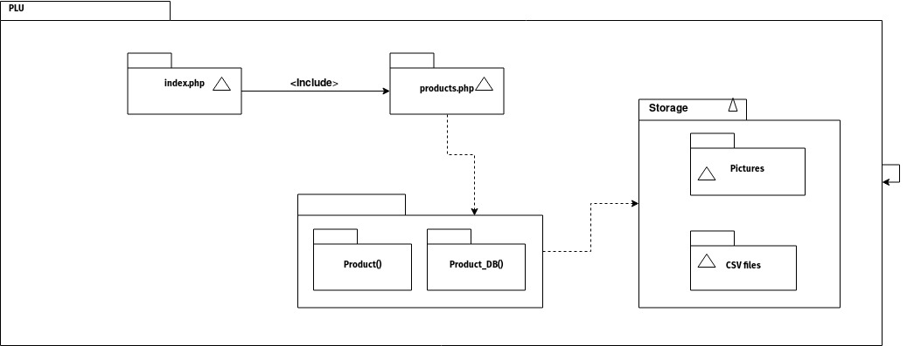

# Sergio David Munoz Sierra - 80500789
# PLU

Price look-up codes made easy developed in PHP.

## Online Version of the report

### URL of the prototype
The prototype is running on localhost in my laptop.

### Description of the features of the prototype
The prototype handles all the basic features:
* Provide an interface with a list and two input fields: "Name", "PLU" and Submit button.
* Product Manager: Add items to list one by one to the list.
* Alphabetical display of items in the list with their PLUs.

The prototype handles these extra features:
* Use checkboxes to move items to the top of the list. Use Move to the list button.
* Add aliases to items. Show in light green. Only for items already in list.
* Add pictures to items.
* Use a file database with .csv values that can be imported and updated.

### Explanation on how to use them. Unless obvious.
To move elements in the top of the list check the checkbox besides the PLU of the item. Then press the `Reorder List` button.

To add an alias to an item enter the alias in the `Product Name` box and its corresponding PLU. Then press `Add Product` button. *NOTE:* If the PLU is not found in the database then the product will be added as a new product and not as an alias.

To add a picture to an item press the `Browse` button and type its corresponding PLU then press `Add Picture` button. If the PLU is not found in the database nothing will happen.

.csv files are read automatically in the storage directory.

### Screenshots with all features
* Interface:


* Add Item:


* Move to top of list:


* Add Alias:


* Add Picture:


### Explanation of the code structure. UML or any diagram would help
The structure of the code is divided into three main components.
* `products.php` - Contains the classes for Product() and Product_DB().
  - Product() class - Has the basic structure of a product. Name, PLU, and Picture pointer are in this class.
  - Product_DB() - Manages Product() objects. Reads and saves to .csv files. Also manages the POST requests.
* `index.php` - Contains the HTML and CSS for displaying the Product_DB() tables. Contains the forms used for POST operations.
* `Storage` - This folder contains the .csv files used for storing the data. Contains the pictures to be displayed in the database table.

Here is a diagram of the structure:



### Code repo
The code resides in:
```https://github.com/sdmunozsierra/pl/tree/master/plu```

### Example of unusual properties of variables in PHP caused problems
* Removing objects from an array was awkward as the only way to "remove" them is by using unset(). So finding the element first and then doing the unset() fixes this problem.
