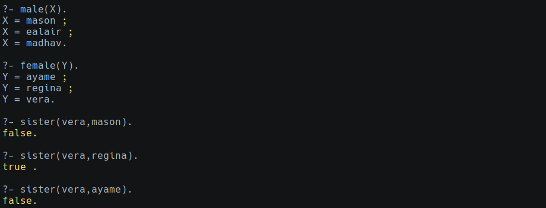
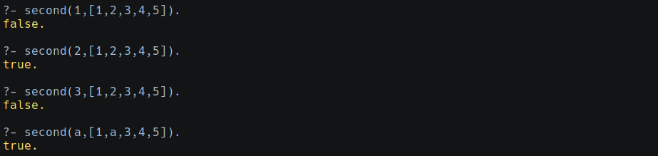
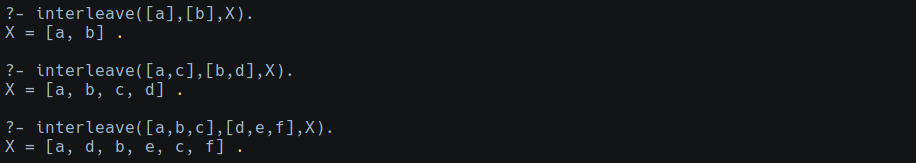

# Prolog Assignment

## Instructions
Do all 5 for an A:

1. structures parent(X,Y), male(X), and female(X), write a structure that defines mother(X,Y).

2. Using the structures parent(X,Y), male(X), and female(X), write a structure that defines sister(X,Y).

3. Write a predicate second(X,List) that checks wether X is the second element of List.

4. Write a predicate twice(n,Out) whose left argument is a list, and whose right argument is a list consisting of every element in the list written twice.

```prolog
twice([a,4,buggle], X).
X=([a,a,4,4,buggle,buggle]).

twice(W,[b,b,a,a]).
W=[b,a].
```

5. Write 3-parameter predicate interleave which takes three lists as arguments and combines the elements of the first two into the third as follows:

```prolog
?-interleave([a,b,c],[d,e,f],X).
X=[a,d,b,e,c,f]
```

## Results
For each, hand in a print-out showing your definition and results with enough test cases to demonstrate the correct behavior.

### Male, Female and Parent Structures:

```prolog
male(mason).  %parent
male(ealair).
male(madhav).

female(ayame). %parent
female(regina).
female(vera).

parent(mason,ealair).
parent(mason,madhav).
parent(mason,regina).
parent(mason,vera).

parent(ayame,ealair).
parent(ayame,madhav).
parent(ayame,regina).
parent(ayame,vera).
```

### 1. Mother Structure
```prolog
mother(X,Y) :- parent(X,Y),female(X).
```


### 2. Sibling and Sister Structure
```prolog
sibling(X,Y) :- parent(W,X),parent(W,Y),not(X=Y).
sister(X,Y) :- sibling(X,Y),female(X).
```


### 3. Second Element
```prolog
second(X,[_|[X|_]]).
```


### 4. Twice
```prolog
twice([],[]).
twice([X|Y],[X,X|Z]) :- twice(X,Z).
```


### 5. Interleave
```prolog
interleave([],[],[]).
interleave([],[H2|T2],[H2|T2]).
interleave([H1|T1],[],[H1|T1]).
interleave([H1|T1],[H2|T2],[H1,H2|TT]) :- interleave(T1,T2,TT).
```

